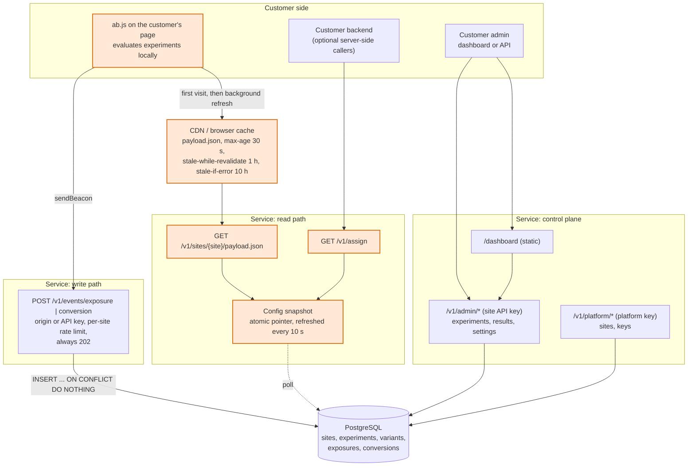
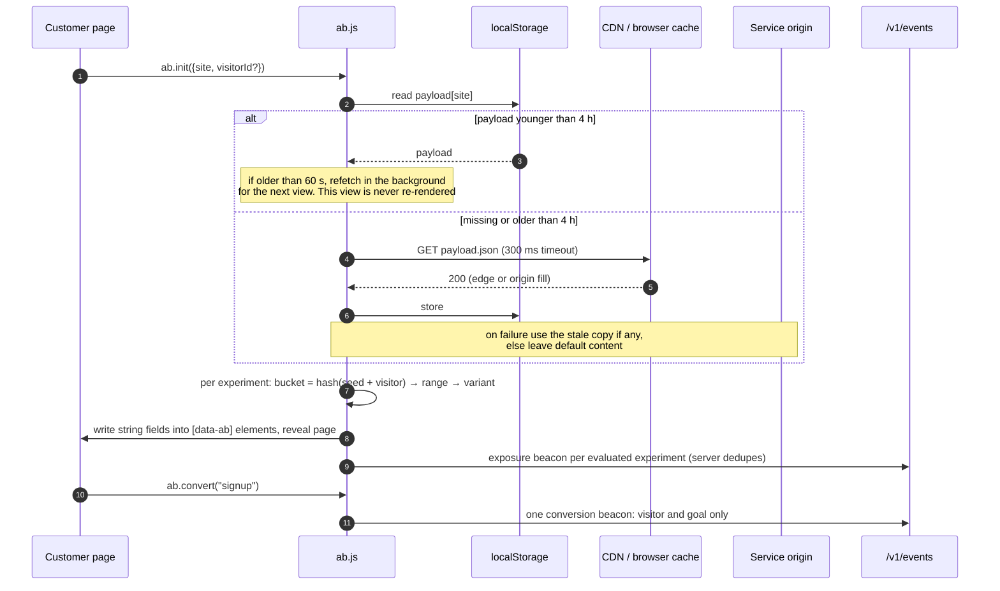
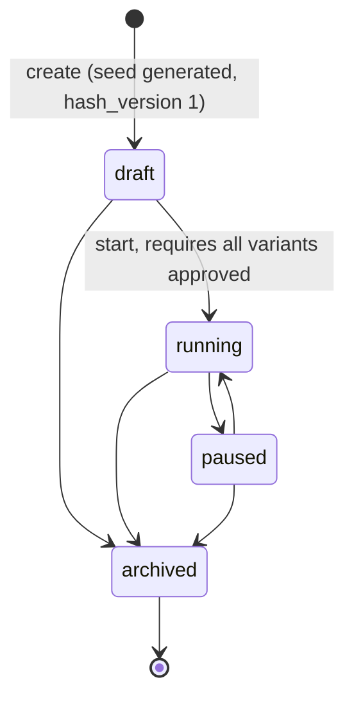
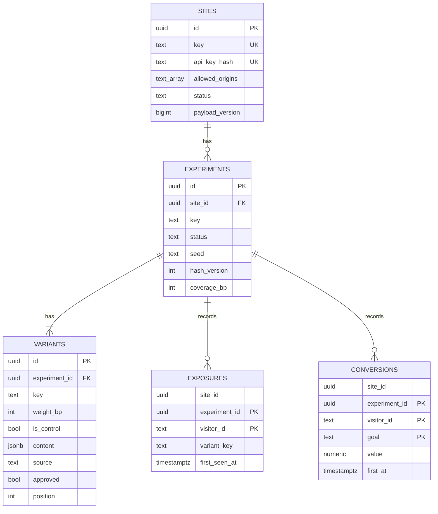

# Design: Variant Assignment Service

A multi-tenant service that answers one question on every page load of a customer's website, "which variant should this visitor see?", records what happened, and reports how each variant is doing. This document goes from the one-paragraph answer down to implementation detail. Each section is deeper than the last; stop when you have what you need.

## 1. The answer in one paragraph

Assignment is a pure function of an experiment's random seed and the visitor's id, so nothing per visitor is ever stored. The function runs **in the visitor's browser** against a small per-site configuration file (the *payload*) that is cached at the edge and in `localStorage`. On a repeat page view the service's servers are not contacted at all; on a first visit the cost is one cached GET. Tracking is a separate, write-only path that accepts beacons and stores them idempotently. Configuration and results live behind a per-site API key. If any part of the service is slow or down, the customer's page still renders, with the last known experiments or with its default content.

## 2. Architecture



The three service blocks are one Go binary. Orange is the page-render critical path. On a repeat view only the snippet runs. The database is never read on that path: the read path serves from an in-memory snapshot, and the write path only inserts.

**The key decisions, each with its reason:**

1. **Decide in the browser.** A per-visitor call to an origin server can never be faster than a cached file plus a local hash. Moving the decision to the client removes the service from the render path entirely after the first visit.
2. **Store nothing per visitor.** Stickiness comes from the hash, not from a lookup. This is what makes client-side evaluation and aggressive caching safe: there is no stored answer a cached one could contradict.
3. **Compile configuration into a public, cacheable payload per site.** The payload carries precomputed bucket ranges, so the browser does one hash and one range scan per experiment. Being a static-looking GET, it is cacheable by any CDN and by the browser.
4. **Keep a Go reference implementation of the same algorithm**, serving `GET /v1/assign` for server-rendered pages and compiling the ranges. A shared golden fixture proves the browser and Go agree.
5. **Separate the write path.** Events are idempotent inserts authenticated by request origin or API key, and they fail by dropping, never by erroring.
6. **One site is one tenant.** A public site key names the payload; a private API key, stored only as a hash, unlocks configuration and results for that site alone.

## 3. How a page view works



Content-driven pages mark elements with `data-ab="<experiment>:<field>"` and the snippet writes matching string fields from the variant's `content`. Key-driven pages read `ab.ready` and branch on the variant key themselves; `content` can carry arbitrary settings. The two styles share one payload and can be mixed.

**Each experiment runs on exactly one page.** An experiment carries a `url_path` such as `/` or `/pricing.html`, and the snippet evaluates it only when `location.pathname` matches (trailing slashes and `/index.html` are normalised identically in Go and JavaScript, with cases in the golden fixture). Exposure is therefore recorded only where the variant is actually shown. **The browser keeps no tracking state.** It sends an exposure for every evaluated experiment on every view, and a conversion names only the visitor and the goal; the server deduplicates exposures by primary key and attributes the conversion to every experiment that visitor has an exposure row for on the site, whichever page it happened on. A signup on a thank-you page therefore counts for a headline test on the home page, and nothing in `localStorage` can go stale or disagree with the server.

One consequence is worth stating plainly: a page view evaluates exactly one payload, so an experiment started seconds ago may be missed by one view. The visitor simply is not in it yet and no exposure is recorded, so results are not biased.

## 4. Determinism

```
bucket(exp, visitor) = fnv1a32( decimal( fnv1a32(exp.seed + visitor_id) ) ) mod 10000
ranges(exp)          = for variant i: [start_i, start_i + weight_i × coverage / 10000)
variant              = the range containing bucket, or none (held back)
```

- Weights are basis points summing to 10,000 and buckets are integers 0..9,999, so Go and JavaScript cannot disagree by floating-point rounding. FNV-1a 32 is chosen because 32-bit arithmetic is exact in JavaScript without BigInt.
- **Why hash twice.** A single FNV-1a pass has weak low-bit mixing on short, similar inputs. In the test suite, one million sequential numeric ids into 10,000 buckets give a chi-square of 7,528 against an expected 9,999 ± 141 with a single pass; the double hash gives 9,907. This is the same scheme GrowthBook uses in its SDKs, chosen so the design matches a widely deployed one.
- **Coverage** shrinks each variant's range from its left edge, so held-back visitors fall in the gaps. Raising coverage only widens ranges to the right: new visitors enter, nobody already assigned moves. The admin API therefore allows coverage to increase while running and rejects everything else that would move visitors (weights, variants), explaining why and suggesting a clone with a new seed.
- **Independence.** Each experiment has a 16-byte random seed, so a visitor's bucket in one experiment says nothing about another, including across tenants.
- **Identity.** The visitor id is a first-party cookie set on the customer's domain, or a stable user id the customer passes in. The example site shows the second: logged-in users get the same variant on every device because the hash input is the account id. Switching identity at login can change the variant; bridging the two is listed as future work.
- **Versioned.** Each experiment records `hash_version`. An evaluator that sees a version it does not implement holds the visitor back, so the algorithm can evolve for new experiments without touching running ones or breaking old snippets.

Verified by: a frozen golden fixture of 282 cases that both the Go tests and the Node tests must match bit for bit; chi-square uniformity over one million visitors; weight shares within 0.5 pp; a ramp test asserting no assigned visitor moves when coverage rises; a cross-seed independence test; and, against the live service, headless-browser checks that the page's decisions equal `GET /v1/assign` for the same visitor.

## 5. Scale

| Path | Scales with | What limits it | Plan |
|---|---|---|---|
| Payload reads | Sites × edges / 30 s at the origin; page views at the cache | Nothing at the origin for any realistic tenant count: fills are independent of visitor count and served from memory | This is the point of the design |
| `/v1/assign` | Server-side callers only | CPU: one map lookup and one 150 ns hash per experiment | Stateless replicas |
| Snapshot | Tenants × experiments | Memory, about 1 KB per experiment; a full reload is three queries | `updated_at` watermark, then a change feed |
| Event writes | Page views × experiments on the page (exposures), plus goals | Postgres insert rate and connections; every page view sends an exposure that the primary key then discards | Browser-side dedupe was removed to keep the client stateless; the first mitigation is in-process batching, then a queue between API and writers; writers stay idempotent |
| Results | Dashboard views × experiment size | Scan of one experiment's events | Incremental counters or a columnar store |
| Storage | Σ unique visitors × experiments | Disk, about 120 bytes per exposure row | Partition by site and month, retention per site |

Read and write traffic scale differently on purpose. Reads are absorbed by caches and never reach the database. Writes are the only path bounded by Postgres, and they are the path that can tolerate loss.

## 6. Reliability and failure modes

| Failure | What the visitor sees | Why |
|---|---|---|
| Payload fetch fails on a first visit | Default content within 300 ms | The page is authored complete; the snippet only swaps text |
| Service origin down | Experiments keep running | CDN serves stale for 10 h; browsers use `localStorage` |
| Database down | Experiments keep running; events are dropped with 202; admin returns 503; `/readyz` says `degraded` but stays 200 | Payload and assign serve from memory; pulling replicas during a config-store outage would turn a degraded control plane into a down data plane |
| Database down at boot | Service refuses to start | Nothing to serve and nothing to fall back to; this is the one moment the database is required |
| Config refresh fails | Last good snapshot keeps serving, `config_age_seconds` rises | Stale configuration beats none |
| Hostile or misconfigured origin posts events | 202, dropped | Origin allow-list, then per-site token bucket |
| Any beacon is malformed | 202, dropped | The write path never returns an error to a browser |
| Snippet throws | Default content | The whole snippet body is in `try/catch`; a safety timer reveals the page even if something hangs |
| Snippet sees an unknown `hash_version` | Held back | Old snippets stay safe when the algorithm evolves |

Server-side guards: 8 KB body limits, per-request context budgets (50 ms memory-only paths, 2 s event writes, 10 s results), a bounded connection pool, graceful shutdown. Per-site token buckets are per replica with no coordination, which is coarse but has no failure mode of its own.

## 7. Correctness of counting

- **Exposures** are keyed by `(experiment, visitor)`; the first write wins and records the variant actually shown. The browser sends one per evaluated experiment per page view and the database discards repeats, so the server does the deduplication and the browser holds no state that could go stale.
- **Conversions** are keyed by `(experiment, visitor, goal)` and never carry a variant. A browser conversion names only the visitor and the goal; the server inserts one row per experiment the visitor has an exposure for, in a single idempotent statement, so attribution is decided by the exposure table alone and a client cannot inflate one arm. Server-side callers may name an experiment explicitly; a conversion recorded that way without a prior exposure is reported as *unattributed*, not counted.
- **Why the server attributes, not the page.** Experiments are page-scoped, so the page where a conversion happens knows only the experiments it evaluated itself. A visitor who saw a headline test on the home page and converts on the pricing page must count for both, and only the server's exposure table knows about the home page. The alternatives were to have the browser remember its own exposures, which is state that can go stale and disagree with the server (an earlier version did this and it failed exactly that way), or to accept losing every cross-page conversion. Attribution at write time is one indexed insert-select and makes unattributed browser conversions impossible by construction.
- **Conversions outlive pauses.** The snapshot indexes every experiment of a site regardless of status, so a visitor exposed before a pause still converts afterwards.
- **What the results page shows:** per variant, exposures, converted visitors, conversion rate, counts and summed value per goal; plus totals, unattributed conversions, and each variant's share of traffic so a skewed split is visible at a glance. The page deliberately shows **counts only**. Significance testing (Wilson intervals, a two-proportion z-test against control, a sample-ratio-mismatch check) was built, then removed by product decision; the design is kept as a next step. Readers should therefore treat small differences on small samples as noise, and the fixed-horizon caveat applies: the longer one watches, the more often noise crosses any threshold.

## 8. The LLM decision

Not built yet; the decision is made. LLM-generated variant copy belongs in the **configuration plane**, as an asynchronous job that produces *draft* variants a human approves before they enter the payload. Never on the assignment path, never per visitor.

- **Latency:** a model call takes seconds; the assignment path is a local hash.
- **Cost:** one call per experiment at setup costs cents; one per page view would exceed any lift found, and in a SaaS it could not be capped per tenant.
- **Validity:** an experiment compares fixed treatments. Content generated per request would make every visitor a different "variant" and the results meaningless.
- **Safety:** generated text is schema-constrained, stripped of markup, length-capped and approved by the customer; the snippet writes it with `textContent`, so even a bad approval cannot inject HTML.
- **Failure isolation:** a failed job leaves the experiment in draft; nothing downstream notices.

The schema already anticipates this: variants carry `source` (manual or llm) and `approved`, and the payload compiler excludes any experiment with an unapproved variant.

## 9. Implementation detail

### 9.1 Code map

| Package | Role |
|---|---|
| `internal/assign` | The hash, ranges and choice. Zero dependencies. Golden fixture in `testdata/golden.json`. |
| `internal/experiment` | Domain types, validation (weights sum to 10,000, one control, key format), status machine. |
| `internal/payload` | Compiles a site's running, fully approved experiments into the public payload with ranges, in canonical order so bytes and ETag are stable. |
| `internal/configcache` | Snapshot behind an atomic pointer; file and database sources; refresher that keeps the last good snapshot on failure. Also indexes sites by API key hash and experiments by key for the auth and events paths. |
| `internal/site` | API key generation and SHA-256 hashing, exact-match origin normalisation, per-site token buckets. |
| `internal/store` | pgx pool, embedded migrations under an advisory lock, repositories, event inserts, results aggregation. |
| `internal/events` | The write path's rules: resolve from snapshot, authorise, limit, validate, insert with a 2 s budget, log the drop reason. |
| `internal/results` | Builds the counts-only report. |
| `internal/httpapi` | Handlers, auth tiers, CORS, request logging, static assets. |
| `web/ab.js` | The browser snippet; `web/ab.test.js` runs under `node --test`. `web/dashboard/` is the customer UI. |
| `examples/customer-site` | A static customer site with login, content-driven and key-driven experiments, and a provisioning script. |

### 9.2 Payload

```json
{ "site": "acme", "version": 42, "experiments": [
  { "key": "hero-cta", "url_path": "/", "seed": "3f9a1c…", "hash_version": 1,
    "ranges": [[0, 4500], [5000, 9500]],
    "variants": [ { "key": "control", "content": { "headline": "Default" } },
                  { "key": "b", "content": { "headline": "Ship faster" } } ] } ] }
```

`url_path` is the one page the experiment runs on. `version` is bumped by every write that changes the compiled payload and doubles as the ETag. Unknown and suspended sites return the same shape with no experiments and the same cache headers, so the snippet and the CDN behave identically. The payload, including seeds, is public by nature; the variants are visible in the DOM anyway and a seed's job is decorrelation, not secrecy.

### 9.3 Snippet behaviour

Loaded by URL or inlined; about 16 KB unminified, 5.4 KB gzipped. Payload host precedence: an explicit `baseUrl`, the host the server bakes into the served file, the origin the script was loaded from, same origin. Cache rules: under 60 s use as is; 60 s to 4 h use as is and refetch in the background; older, fetch synchronously with a 300 ms timeout and fall back to the stale copy. One payload per page view. The page is revealed by setting `data-ab-ready` on `<html>`, so pages hide `[data-ab]` elements with one CSS rule until then. `?ab_force=exp:variant` overrides for QA. Beacons use `sendBeacon` with a `fetch keepalive` fallback and a `text/plain` body so there is no CORS preflight; exposures fire only after content is applied, so the DOM and `ab.ready` agree with what was reported. The snippet keeps no record of what it has sent: exposure repeats are deduplicated by the server, and conversions carry no experiment.

### 9.4 Tenancy and credentials

| Credential | Appears in | Unlocks |
|---|---|---|
| Site key (public) | Payload URL, `/v1/assign`, beacon bodies | Reading that site's payload; browser beacons for that site when the request `Origin` is in the allow-list |
| Site API key (private, `sk_live_…`, SHA-256 stored) | `Authorization: Bearer` on `/v1/admin/*` and optionally on `/v1/events/*` | Everything about one site |
| Platform key | `Authorization: Bearer` on `/v1/platform/*` | Create, suspend, delete sites; rotate keys |

Site authentication is a snapshot lookup with no I/O, falling back to the database only for a key created seconds ago on another replica. Control-plane writes refresh the local snapshot immediately; other replicas pick the change up on their next 10 s poll. Cross-tenant reads and writes answer 404 and are covered by tests. Origin matching is exact after normalisation, no wildcards.

### 9.5 Experiment lifecycle



Drafts are freely editable. Once an experiment has run, weights and variants are immutable and coverage may only increase; the API says so in its 409 responses and suggests cloning with a new seed. The page an experiment runs on can be changed at any time before archiving: that changes who enters the experiment, never which arm anyone is in. Archived experiments are immutable. Every transition bumps the site's payload version in the same transaction.

### 9.6 Data model



Ranges are not stored; they are derived at compile time by the same package that serves `/v1/assign`. `site_id` is denormalised onto events so every results query and deletion is a single-table predicate and a future partition by tenant needs no schema change. Indexes: `exposures(experiment_id, variant_key)` for results, `exposures(site_id, visitor_id)` for conversion attribution, and `site_id` on both event tables for deletion. Migrations are embedded SQL files applied at boot under an advisory lock.

### 9.7 Testing

Unit tests for the hash (golden, distribution, independence, ramp), validation, payload compilation, origin matching and token buckets. Node tests for the snippet against the same golden fixture plus the caching and beacon rules with fakes. Integration tests against an isolated Postgres schema per test: migrations, tenancy, the status machine, refresh pickup, database outage, restart stability, event idempotency, auth rules, and results. Headless-browser runs against the live service and the example site check the end-to-end story: one payload request then none, stable variants, parity with `/v1/assign`, beacons sent once and stored once, and the dashboard flows.

## 10. Trade-offs and next steps

**Deliberately not built, in rough priority:**

- **Deployment and measurement.** The service runs locally against Postgres; the hosted deployment, CDN in front, and published latency numbers are the next phase.
- **LLM-generated variants** as described in §8.
- **Significance testing** on the results page, then sequential or Bayesian analysis to address peeking.
- **Richer page targeting.** Today an experiment runs on exactly one path. Patterns or lists of pages, and URL-triggered goals (visiting `/thank-you` counts as `signup`), are the natural extensions.
- **Sticky buckets across identity changes**, so a visitor keeps a pre-login variant after logging in.
- **Propagation.** Purge the CDN on publish and push updates to open tabs; today propagation is bounded by the 30 s edge cache plus the 60 s browser window.
- **Durable event queue** so a database outage delays events instead of losing them.
- **Server SDKs** holding the payload in process, so server-rendered pages need no per-render call.
- **Shared rate limiting**, bot filtering, retention policies, accounts with multiple sites, namespaces for mutually exclusive experiments, and smarter allocation (bandits) that updates ranges without changing the evaluator.

**Trade-offs accepted:** events are lost during a database outage rather than queued; an experiment is tied to one page, so a site-wide element such as a navigation bar needs one experiment per page; configuration is public rather than hidden behind per-visitor server calls; the snippet is larger than ideal because it carries the evaluator, in exchange for zero network on repeat views.
