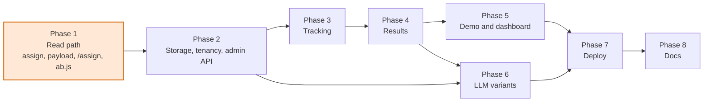

# Implementation Plan: Phases and Checkpoints

Sources: [brief](./staff-engineer-takehome-assignment-brief.md), [technical plan](./technical-plan.md). This document turns the technical plan into an ordered, resumable build. It does not repeat design reasoning; section references (`TP §n`) point at the technical plan.

## How to use this document

**Checkpoints are the unit of work.** Every phase is split into checkpoints of at most ~1.5 h. A checkpoint is done when its *Done when* checks pass. There is no partial state between checkpoints: if work on a checkpoint is interrupted, either finish it or discard its changes and restart that checkpoint. Checkpoints are sized so that a restart costs little.

**Progress log.** The checklist below is the single source of truth for where the build is. Tick a box the moment the checkpoint's *Done when* checks pass, in the same edit pass as the work itself, so the checklist and the tree never disagree.

**Review before commit.** Nothing is committed without the owner's review. A finished checkpoint is left as uncommitted changes with its box ticked; the owner reviews the diff and either asks for changes or gives the go-ahead to commit. Several reviewed checkpoints may be committed together, one commit per checkpoint.

**Resume protocol** (run at the start of any session, including the first):

1. Run `git status`. Uncommitted changes are expected when ticked checkpoints are awaiting review; compare the ticked boxes against `git log` to see which. If there are changes for a checkpoint whose box is *not* ticked, the previous session stopped mid-checkpoint: run its *Done when* checks; if they pass, tick the box, otherwise discard those changes and restart the checkpoint.
2. Find the first unticked box.
3. Re-run the *Done when* checks of the last ticked checkpoint to confirm the tree is in the expected state.
4. Start the next checkpoint. Read only the TP sections it cites.

**Commits** (after review only). One commit per checkpoint, subject in imperative mood describing the change, not the checkpoint id. Never mention any company (brief constraint). Never commit secrets; `.env` is gitignored from checkpoint 1.1 on.

### Progress log

Phase 1: Read path

- [x] **1.1** Scaffold, module, CI, `.env.example`, Dockerfile (0.5 h)
- [x] **1.2** `internal/assign` + golden fixture + statistical tests (1.5 h)
- [x] **1.3** `internal/experiment` validation + `internal/payload` compiler (1.0 h)
- [x] **1.4** Snapshot, file-backed config, payload and assign endpoints, server binary (1.5 h)
- [x] **1.5** `web/ab.js` evaluator + Go/JS parity test + minimal demo page (1.5 h)

Phase 2: Storage, tenancy, admin API

- [ ] **2.1** Postgres schema, migrator, store, integration test harness (1.0 h)
- [ ] **2.2** Sites, credentials, auth middleware, origin matcher, rate limiter (1.0 h)
- [ ] **2.3** Admin experiment API with status machine (1.0 h)
- [ ] **2.4** Refresher goroutine, version bump, tenant isolation tests (1.0 h)

Phase 3: Tracking

- [ ] **3.1** Exposure and conversion endpoints (1.0 h)
- [ ] **3.2** Snippet tracking: exposure dedupe, `ab.convert` (0.5 h)

Phase 4: Results

- [ ] **4.1** Statistics: Wilson, z-test, SRM (0.75 h)
- [ ] **4.2** Results query and endpoint (0.75 h)
- [ ] **4.3** Simulate endpoint (`DEMO_MODE`) (0.5 h)

Phase 5: Demo and dashboard

- [ ] **5.1** Demo page with simulate button (0.75 h)
- [ ] **5.2** Dashboard: site settings, experiments (1.25 h)
- [ ] **5.3** Dashboard: results view (0.5 h)
- [ ] **5.4** Snippet hardening and fail-safe test page (0.5 h)

Phase 6: LLM-generated variants

- [ ] **6.1** LLM client interface, Anthropic implementation, fake (1.0 h)
- [ ] **6.2** LLM jobs table, worker, generate/approve endpoints (1.0 h)
- [ ] **6.3** Dashboard: generate with AI (0.5 h)

Phase 7: Deploy

- [ ] **7.1** Fly.io + Neon deployment, demo site bootstrap, smoke test (1.0 h)
- [ ] **7.2** CDN in front, load test, recorded numbers (0.5 h)

Phase 8: Documentation

- [ ] **8.1** README with integration guide (1.0 h)
- [ ] **8.2** Design document (1.5 h)
- [ ] **8.3** Walkthrough script, hygiene pass (0.5 h)

Buffer: 0.5 h. Total 24 h. If the clock forces cuts, cut from the end of phase 6 (keep 6.1 and the design-document discussion), then 7.2, then 5.3 and 5.4. Phases 1 to 4 and 8 are never cut.

## Phase map

Phase 1 is the whole render-path story and is demoable on its own with a JSON config file and no database. Everything after it is periphery that feeds or consumes the payload (TP §1). Phase 6 depends on phase 2 (store, admin API) and on phase 4 only for the dashboard results view it sits next to; it can be built in parallel with phase 5 if two sessions are available.

---

## Phase 1: Read path

**Goal.** A visitor's browser, given a site key, fetches a compiled payload and computes variants locally with the same answer the Go reference gives. Server-side callers get the same answer from `GET /v1/assign`. No database yet: config comes from a JSON file, so the critical path is finished and testable before any storage decision can slow it down.

**Exit criteria.** `go test ./...` and `node --test web/*.test.js` pass; `go run ./cmd/server` with a sample config serves a payload with correct cache headers and `/v1/assign` agrees with the browser evaluator on the golden fixture; the minimal demo page shows a variant that is stable across reloads and changes when the cookie is cleared.

### 1.1 Scaffold

TP §2, §14.

- `go mod init` with a generic module path (repo name chosen here; no company names). Go 1.22+.
- Directory layout from TP §14, with `doc.go` stubs so packages compile: `cmd/server`, `internal/{assign,experiment,payload,configcache,httpapi}`, `web/`, `migrations/`, `deploy/`, `scripts/`.
- `.gitignore` (`.env`, binaries, `node_modules`), `.env.example` with every variable from TP §14 and placeholder values, `Makefile` (`build`, `test`, `test-js`, `run`, `lint`).
- `deploy/Dockerfile`: multi-stage, static binary, `web/` and `migrations/` embedded via `embed`, so the image is one binary.
- CI workflow: `go vet`, `go test ./...`, `node --test web/*.test.js`.
- `README.md` stub: one paragraph and a "work in progress" marker.

**Done when:** `go build ./...` succeeds; `make test` runs (zero tests is fine); `docker build -f deploy/Dockerfile .` succeeds; CI config passes a syntax check.

### 1.2 Core: `internal/assign`

TP §5.1, §5.2.

- `fnv1a32(s string) uint32`; `Bucket(seed, visitorID string, hashVersion int) (int, bool)` returning `false` for unknown versions; `Ranges(weightsBP []int, coverageBP int) [][2]int`; `Choose(bucket int, ranges [][2]int) int` returning `-1` for held back.
- Input guard: visitor id printable ASCII, 1..128 bytes; otherwise held back.
- Sanity vectors first: `fnv1a32("") == 0x811c9dc5`, `fnv1a32("a") == 0xe40c292c`.
- Golden fixture `internal/assign/testdata/golden.json`: ~200 cases over several seeds, visitor id shapes (UUIDs, short numerics, emails), weight sets (50/50, 90/10, 33/33/34, 1/99), coverages (100 %, 90 %, 10 %), with expected `bucket` and `variant_index`. Generated once by a small Go program under `//go:build ignore`, then frozen; the test reads it, never regenerates it.
- Tests: golden; 1M-visitor chi-square over 10,000 buckets within tolerance; weight shares within ±0.5 pp; independence across two seeds; coverage ramp never moves an assigned visitor; unknown hash version held back; bad visitor id held back.
- Benchmark `BenchmarkBucket` for the design document.

**Done when:** `go test ./internal/assign/ -run . -count=1` passes including the 1M test (keep it under ~2 s; mark `-short` to skip); golden fixture committed.

### 1.3 Domain and payload compiler

TP §7.1 payload shape, §8 (types only).

- `internal/experiment`: `Site`, `Experiment`, `Variant` types; `Validate()` enforcing weights sum to 10,000, exactly one control, unique variant keys, coverage 0..10,000, status enum, key format (`[a-z0-9-]{1,64}`).
- `internal/payload`: `Compile(site, experiments) Payload` producing the exact JSON shape of TP §7.1 with `ranges` from `assign.Ranges`, only `running` experiments, only approved variants, variants in `position` order. `Version` passed in by the caller (file loader uses a hash of the file; the refresher will use `sites.payload_version`). Deterministic serialization so ETag is stable.
- Tests: validation table; compile output matches a fixture; empty site compiles to `{"site":..,"version":..,"experiments":[]}`; draft and paused experiments excluded.

**Done when:** `go test ./internal/experiment/ ./internal/payload/` passes.

### 1.4 Snapshot, file-backed config, HTTP read path

TP §3 (read path block), §4, §7 (CORS rules), §7.1, §10 server guards.

- `internal/configcache`: `Snapshot` as `atomic.Pointer[map[string]*payload.Payload]`, `Get(siteKey)`, `Swap(new)`. A `Source` interface `Load(ctx) (map[string]*Payload, error)` with a `FileSource` reading `CONFIG_FILE` (JSON: sites with experiments and variants, format documented in the file's header comment and in `testdata/config.sample.json`). Loader keeps last good snapshot on error.
- `internal/httpapi`: stdlib router. `GET /v1/sites/{site}/payload.json` with `Cache-Control: public, max-age=30, stale-while-revalidate=3600, stale-if-error=36000`, `ETag: "<version>"`, `304` on `If-None-Match`, unknown site returns `200` empty payload with the same headers. `GET /v1/assign?site&v&e` using `assign` against the snapshot, `Cache-Control: private, max-age=30`, empty assignments on any bad input. CORS middleware (`Access-Control-Allow-Origin: *`, no credentials). `/healthz`, `/readyz` (snapshot age, never 503 once a snapshot exists). Per-request 50 ms context budget on both endpoints. `slog` request logging.
- `cmd/server/main.go`: env parsing, file source, server with timeouts, graceful shutdown.
- Tests: handler tests with `httptest` for headers, ETag round trip, unknown site, bad input fail-open, assign result equals `assign` package directly.

**Done when:** `go test ./...` passes; `CONFIG_FILE=internal/configcache/testdata/config.sample.json go run ./cmd/server` then `curl -i localhost:8080/v1/sites/demo/payload.json` shows the headers and ranges, and `curl 'localhost:8080/v1/assign?site=demo&v=visitor-1'` returns an assignment; a second curl with `If-None-Match` returns `304`.

### 1.5 Browser evaluator and parity test

TP §4 (two thresholds), §5.4, §13.1 (everything except tracking).

- `web/ab.js`: pure evaluator functions (`fnv1a32`, `bucket`, `choose`) exported for tests under `node` and attached to `window.ab` in the browser. `ab.init({site})`: `_abv` cookie, `localStorage` payload with 60 s stale TTL and 4 h max age, background refetch, 300 ms `AbortController` fetch with stale fallback, exactly one payload per page view, `?ab_force` override, unknown `hash_version` held back, `data-ab="<exp>:<field>"` `textContent` application for string fields only, reveal on success or failure, `ab.ready` promise never rejects, whole body in `try/catch`. `ab.convert` and exposure beacons are no-op stubs until phase 3. Size target ≤ 4 KB minified; no build step, check size in CI.
- `web/ab.test.js` under `node --test`: loads `../internal/assign/testdata/golden.json` and asserts every case; `localStorage` rules with a small fake (`single payload per view`, `background refresh does not touch DOM`, `stale used when fetch fails`, `unknown hash_version held back`).
- `GET /v1/ab.js` served from the embedded `web/` with long public cache headers.
- `web/demo/index.html` minimal: inline snippet, one `data-ab` headline, one CTA, visible visitor id and variant for manual checks. Served at `/demo`.

**Done when:** `node --test web/*.test.js` passes; `go test ./...` passes; open `/demo` with the sample config, reload several times and the variant is stable, clear the `_abv` cookie and across ~20 reloads both variants appear; DevTools shows one payload request on first load and none on reload within 60 s. After review, the commit is tagged `read-path-complete`.

---

## Phase 2: Storage, tenancy, admin API

**Goal.** Configuration lives in Postgres, is owned per site behind an API key, and reaches the snapshot through the refresher. The file source stays available for tests and local demos.

**Exit criteria.** A site can be created with the platform key, an experiment created and started with the site key, and the payload endpoint reflects it within `CONFIG_REFRESH_INTERVAL` with a bumped version. Tenant isolation tests pass.

### 2.1 Schema, migrator, store

TP §8.

- `migrations/0001_init.sql`: `sites`, `experiments`, `variants`, `exposures`, `conversions` exactly as the ER diagram, with the indexes listed in TP §8 notes. (`llm_jobs` arrives in 6.2 as `0002`.)
- `internal/store`: pgx pool with max connections and acquire timeout from env; embedded migrator applying `migrations/*.sql` in order with a `schema_migrations` table; repository methods for sites, experiments, variants (events come in 3.1).
- `docker-compose.yml` with Postgres for local work; integration tests skip when `TEST_DATABASE_URL` is unset, run in CI with a Postgres service.

**Done when:** `TEST_DATABASE_URL=... go test ./internal/store/` passes; migrator is idempotent on a second run; `go run ./cmd/server` with `DATABASE_URL` set applies migrations at boot and still serves the empty read path.

### 2.2 Sites, credentials, middleware

TP §6, §7.3.

- `internal/site`: API key generation (`sk_live_` prefix plus 32 random bytes, base62), SHA-256 hashing, constant-time compare; origin matcher (scheme + host + port exact match, no wildcards); per-site token bucket with configurable rps and burst, fail-open on limit.
- `internal/httpapi`: Bearer middleware with two tiers (platform key from env; site key resolved by hash through the snapshot, so auth does no I/O); `POST /v1/platform/sites`, `POST /v1/platform/sites/{key}/rotate-key`, `PATCH` suspend/reactivate, `DELETE` cascade.
- Snapshot now carries per-site auth material (`api_key_hash`, `allowed_origins`, limits, status) alongside the payload, loaded by the source.
- Tests: key hashing and matching, origin matcher table, token bucket timing, platform endpoints with a real store, suspended site returns empty payload.

**Done when:** integration tests pass; a site created via curl appears in the DB with only the hash stored; the returned API key is never logged (grep the test log).

### 2.3 Admin experiment API

TP §7.2 (all rows except results, generate, jobs, approve, simulate).

- `POST`, `GET` list, `GET` detail, `PATCH` on `/v1/admin/experiments`, site implied by key. Status machine `draft → running → paused → archived`, `paused → running` allowed. Coverage may only increase while running; weights and variants are rejected once running, with the explanatory messages from TP §18.6. Seed generated server-side, `hash_version = 1`.
- `GET`/`PATCH /v1/admin/site`.
- Every mutating write bumps `sites.payload_version` in the same transaction.
- Tests: status transition table, rejection cases with messages, version bump observed, `(site_id, key)` uniqueness.

**Done when:** integration tests pass; curl can create and start an experiment on a site using only that site's key.

### 2.4 Refresher and tenant isolation

TP §3 (Refresher), §11 (snapshot row), §16 integration list.

- `configcache.DBSource` loading all active sites and their running experiments; refresher goroutine polling every `CONFIG_REFRESH_INTERVAL` (default 10 s), swapping the snapshot only on success, exposing `config_age_seconds` in `/readyz` and logs. Keep last good snapshot on any error.
- Tests: change in DB appears in payload after one tick with incremented `version` and new `ETag`; refresher survives a DB outage (store double returning errors) and keeps serving; **isolation**: site A's key cannot read, mutate, or list site B's experiments; restart the server and `/assign` answers are unchanged.

**Done when:** `go test ./...` with `TEST_DATABASE_URL` passes; manual: create experiment, start it, watch `/v1/sites/{site}/payload.json` version change within 10 s.

---

## Phase 3: Tracking

**Goal.** Exposures and conversions are stored durably and idempotently, authenticated by origin or API key, and never return an error status to a browser.

### 3.1 Event endpoints

TP §7.1 event rows, §7.5, §10.

- `internal/events`: `RecordExposure`, `RecordConversion` with `INSERT ... ON CONFLICT DO NOTHING`, `site_id` denormalised, 2 s context timeout, errors logged and swallowed.
- `POST /v1/events/exposure`, `POST /v1/events/conversion`: body parsed as JSON regardless of content type, 8 KB limit, field length limits, auth rule (allow-listed `Origin` or Bearer site key for the same site), per-site token bucket, always `202`, drop with a log reason when auth, limit, or validation fails. Variant for a conversion is never taken from the client.
- Tests: duplicate exposure leaves one row; conversion idempotent per goal; wrong origin dropped with `202`; API key path works without `Origin`; failing store double still returns `202`; `text/plain` body with `sendBeacon` shape parses.

**Done when:** integration and handler tests pass; curl with a valid `Origin` header writes a row and a repeat writes none.

### 3.2 Snippet tracking

TP §13.1 tracking bullets.

- Replace the stubs: exposure via `sendBeacon` (fallback `fetch` with `keepalive`), once per `(visitor, experiment, variant)` using a `localStorage` set, fired after evaluation and when `ready` resolves; store `{experiment: variant}` for `ab.convert(goal, {value})`, which sends one beacon per assigned experiment.
- Tests: dedupe set behaviour; convert sends one beacon per experiment; nothing is sent for held-back experiments or on failure paths.

**Done when:** `node --test web/*.test.js` passes; demo page against the local server produces one exposure row per reload session and a conversion row on button click.

---

## Phase 4: Results

**Goal.** Per-variant counts, rates, intervals, uplift, p-value, SRM, and warnings for one experiment, computed on demand and scoped to the site.

### 4.1 Statistics

TP §9.

- `internal/results/stats.go`: Wilson 95 % interval, two-proportion z-test p-value (normal CDF via `math.Erfc`), chi-square SRM against expected shares from ranges with p-value (chi-square CDF for k−1 degrees of freedom via regularized gamma, or a table for small k).
- Tests against hand-computed and published values; edge cases of zero exposures and zero conversions.

**Done when:** `go test ./internal/results/` passes.

### 4.2 Results query and endpoint

TP §7.6, §9.

- Aggregation query from TP §7.6 with `site_id` predicate; unattributed conversion count; assemble the JSON of TP §9; warnings for fewer than 1,000 exposures per variant and for SRM failure; `GET /v1/admin/experiments/{key}/results` with a 10 s budget.
- Tests: fixture data with known counts yields the expected JSON; conversion without exposure is unattributed; site B's key gets `404` for site A's experiment.

**Done when:** integration tests pass; curl returns the §9 shape for the demo experiment.

### 4.3 Simulate endpoint

TP §7.2 last row, §13.3.

- `POST /v1/admin/simulate {experiment, visitors, conversion_rates: {variant: p}}` only when `DEMO_MODE=true`; synthetic visitor ids evaluated with `assign` from the snapshot, exposures and conversions written through `internal/events` in batches.
- Test: 500 visitors produce exposures close to the configured split and conversions close to the rates.

**Done when:** test passes; results endpoint shows a populated table immediately after a simulate call.

---

## Phase 5: Demo and dashboard

**Goal.** A visitor-facing demo and a customer-facing dashboard, both static files served by the binary.

### 5.1 Demo page

TP §13.3. Extend `web/demo/index.html`: preconnect hint, headline and CTA under experiment, visible visitor id and assignment, "Simulate 500 visitors" button calling simulate with the demo site's key (embedded only in `DEMO_MODE`), link to the dashboard. **Done when:** full flow works locally from a fresh browser profile.

### 5.2 Dashboard: settings and experiments

TP §13.2. `web/dashboard/index.html`, `app.js`: API key prompt stored in `sessionStorage`, site settings view and origins edit, experiment list, create form (percentages shown, basis points sent, coverage), status buttons honouring the state machine, payload version display. No framework, no build. **Done when:** every admin call from 2.3 is reachable from the UI and errors from the API are shown verbatim.

### 5.3 Dashboard: results

TP §9, §13.2. Results table with CI, uplift, p-value, SRM badge, low-sample warning, unattributed count, refresh button. **Done when:** matches the JSON for the demo experiment.

### 5.4 Snippet hardening

TP §10 snippet rows, §16 fail-safe. `web/failsafe.html` test page pointing at a dead host asserting defaults are revealed within the timeout; `ab.js` served with `Cache-Control: public, max-age=86400`; size check in CI; a deliberate exception injected in a test confirms the `try/catch` reveals defaults. **Done when:** fail-safe page passes by hand and the size check is green.

---

## Phase 6: LLM-generated variants

**Goal.** Draft variants generated asynchronously in the configuration plane, schema-validated, human-approved, never on the request path.

### 6.1 LLM client

TP §12.

- `internal/llm`: `Client` interface `Generate(ctx, req) ([]Draft, error)`; Anthropic Messages API implementation over `net/http` with `LLM_MODEL` (default `claude-sonnet-5-5`), 20 s timeout, system prompt instructing JSON-only output in the requested schema, customer brief in a delimited user turn; response parsing, schema validation, HTML stripping, length caps; `Fake` for tests.
- Tests: fake round trip; `httptest` server simulating success, malformed JSON, timeout, 429.

**Done when:** `go test ./internal/llm/` passes with no network; `ANTHROPIC_API_KEY` is read only in `cmd/server`.

### 6.2 Jobs, worker, endpoints

TP §7.2 generate/jobs/approve, §7.7, §8 `LLM_JOBS`.

- `migrations/0002_llm_jobs.sql`; worker goroutine claiming with `UPDATE ... RETURNING`, bounded concurrency (2), two retries with backoff, per-site daily quota (20) checked at enqueue; drafts written as `source=llm, approved=false`.
- `POST .../variants/generate`, `GET /v1/admin/jobs/{id}`, `POST .../variants/{vkey}/approve` (draft experiments only). Payload compiler already excludes unapproved variants (1.3).
- Tests with the fake client: queued → done with drafts; failure → failed after retries; quota exceeded → `429`; approve on running experiment → `409`.

**Done when:** integration tests pass; with a real key, one curl walkthrough produces drafts; without a key the server starts and generate returns `503` with a clear message.

### 6.3 Dashboard: generate

Button and brief form on the experiment page, job polling, draft list with Approve. **Done when:** the flow works against the fake-backed server in `DEMO_MODE`.

---

## Phase 7: Deploy

**Goal.** Service and storage live and reachable from outside, demo site seeded, numbers measured.

### 7.1 Fly.io and Neon

TP §2 hosting, §15 phase 8.

- Neon database; Fly app from `deploy/Dockerfile` and `deploy/fly.toml`, secrets set with `fly secrets`, migrations at boot, `/healthz` as the health check, two machines.
- `DEMO_MODE=true` seeds an idempotent `demo` site (key from env) with allow-list containing `PUBLIC_BASE_URL`, and one running experiment.
- Smoke test script `scripts/smoke.sh` run from a machine outside the deployment: payload headers, assign, exposure, results.

**Done when:** smoke script passes against the public URL; dashboard loads over HTTPS.

### 7.2 CDN and load test

- Cloudflare in front, cache rules honouring origin `Cache-Control`; verify `cf-cache-status: HIT` on the payload. If this fights back for more than 30 minutes, skip: Fly serves the same headers and the design document explains the difference.
- `scripts/loadtest.sh` with `hey` against payload-through-CDN and `/v1/assign` at origin; record p50/p99 and error rate into `docs/measurements.md` for the design document.

**Done when:** numbers recorded; CDN status (used or skipped) noted in the progress log row.

---

## Phase 8: Documentation

### 8.1 README

Setup, run locally (compose + `make run`), env table from `.env.example`, deploy steps, API overview with curl examples, integration guide (preconnect, inline vs URL, content-driven vs key-driven, server-side `/v1/assign`, delayed-entry semantics), link to the design document. **Done when:** a fresh clone can follow it to a running local server.

### 8.2 Design document

`DESIGN.md` at the repo root, sections in the order the brief lists them: architecture, determinism, scale, reliability and failure modes, correctness, the LLM decision, trade-offs and next steps. Expanded from TP §1 to §13 with the measured numbers from 7.2, the Mermaid diagrams from the technical plan (re-validated), and TP §17 as next steps. **Done when:** every brief bullet has a section and every diagram renders.

### 8.3 Walkthrough and hygiene

- `scripts/demo.sh`: create site → experiment → generate → approve → start → payload → simulate → results, with placeholders for keys.
- Hygiene: `git log --all -p | grep -i` for the company name and product, repo name check, `.env.example` has no real values, `gitleaks` or equivalent secret scan, `go vet`, `gofmt`, snippet size check, all CI green.

**Done when:** hygiene checklist is clean and recorded in the progress log; submission list from the brief is complete.
