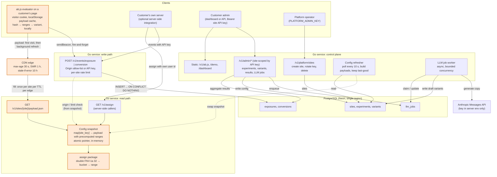
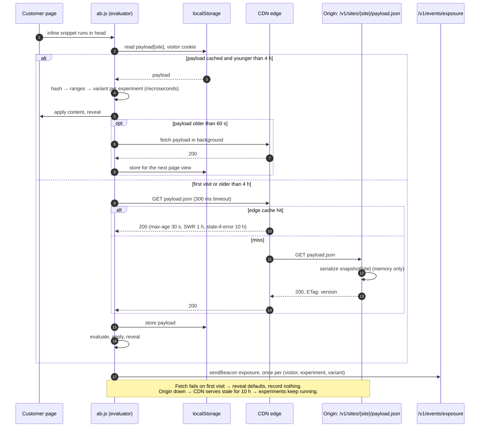
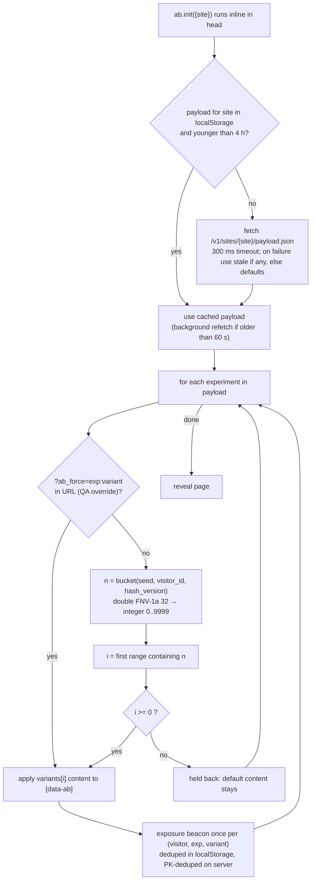
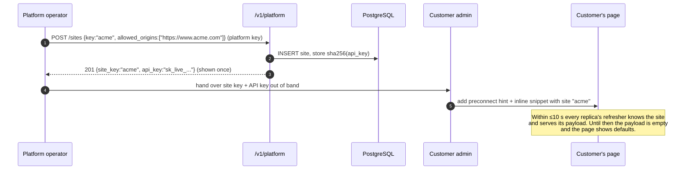
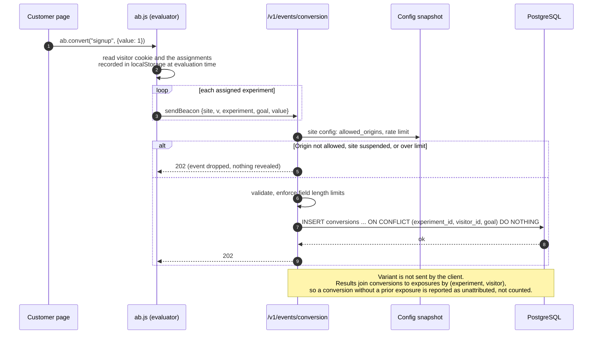
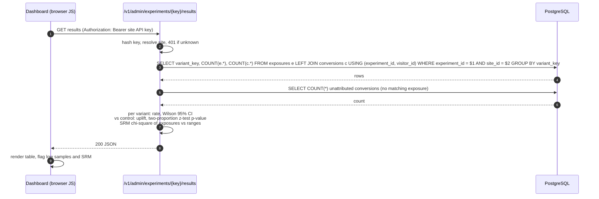
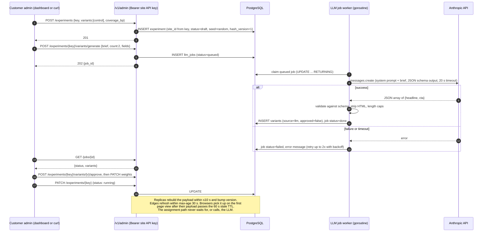
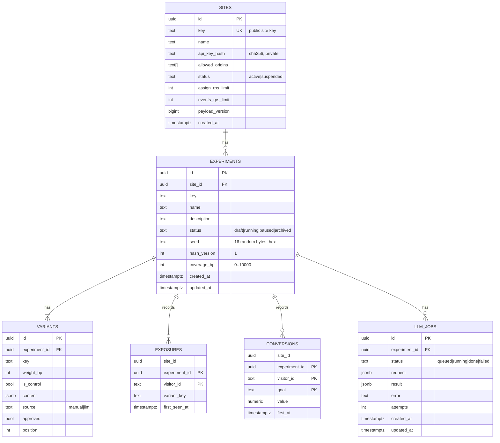

# Technical Plan: Multi-Tenant Experimentation & Variant Assignment Service

Source brief: [staff-engineer-takehome-assignment-brief.md](./staff-engineer-takehome-assignment-brief.md)

This document is the implementation plan. It decides what gets built, in what order, and why. The design document that ships with the code will expand the reasoning here into the sections the brief asks for.

**Framing.** This is a SaaS product. Third-party customers (tenants) sign up, receive credentials, paste a snippet into their own pages, and manage their own experiments. Their visitors never see us; their pages depend on us on every load. Every design choice below is made with two populations in mind: the customer who configures and reads results, and the customer's visitors whose page load we must not slow down or break.

---

## 1. The core problem

Every requirement in the brief hangs off one question asked on every page load of every customer site:

> "Which variant should this visitor see right now?"

Everything else (tracking, results, configuration, LLM content, tenancy) is periphery that feeds or consumes that answer. The core must therefore be:

| Property | Consequence for the design |
|---|---|
| Deterministic and sticky across restarts | Assignment must be a **pure function** of `(experiment, visitor)`. No stored per-visitor state, anywhere. |
| Honours allocation across the population | A **uniform hash** mapped onto weighted bucket ranges. Verified statistically, not assumed. |
| Multiple experiments and variants | Independent hash per experiment (per-experiment seed), so a visitor's bucket in one experiment does not correlate with another. |
| Fast, on the render path | The decision runs **in the visitor's browser** against a per-site config payload that is cached at a CDN edge and in `localStorage`. First visit costs one edge round trip; every later page view costs zero network. Our origin is not on the render path at all. |
| Never breaks a customer page | Fail open to default content at every layer: snippet `try/catch`, fetch timeout, stale payload served when the origin is down. |
| Safe with many tenants | Every read and write is scoped to a site. Public credentials (site key) can only read public config; private credentials (API key) are needed for anything else. |

The design decision that unlocks all of this: **assignment is stateless hashing over a per-site config payload, evaluated wherever the payload is.** By default that is the browser. For server-rendered customers it is our Go service via an API. Both run the same algorithm against the same payload and agree bit for bit. Storage is only needed for configuration (read rarely, compiled into the payload) and for events (write-only, off the render path).

This is the model GrowthBook, Statsig and similar platforms converged on, and the reason is the brief's own constraint: a per-visitor call to an origin server can never be faster than a CDN-cached file plus a local hash.

Build order follows the same logic: core first, then outward.

```
assign (pure Go package + golden fixture)  →  snapshot + payload + /assign API  →  Postgres + sites + admin API
  →  tracking  →  results + stats  →  JS evaluator snippet (parity test) + demo + dashboard  →  LLM generation  →  deploy
```

---

## 2. Stack and justification

| Layer | Choice | Why |
|---|---|---|
| Backend | **Go 1.22+**, stdlib `net/http` router, `log/slog` | Single static binary, predictable low-latency with small GC pauses, trivial concurrency for the config refresher and the LLM job worker. Stdlib router (method + pattern matching since 1.22) avoids a framework dependency. |
| Database | **PostgreSQL** via `pgx/v5` | Durable event storage with `ON CONFLICT` for idempotency, `jsonb` for variant content, easy aggregation for results, row-level tenant scoping via `site_id`. One datastore keeps the deployment small. |
| Migrations | SQL files embedded with `embed`, applied at startup by a small migrator | No external tool needed in the container. |
| Hashing | **Double FNV-1a 32-bit**, `hash_version = 1` stored per experiment | 32-bit arithmetic is exact in JavaScript without BigInt, so the browser and Go implementations are tiny and identical. Single-pass FNV-1a 32 has weak low-bit mixing on short similar strings, which shows up as non-uniform buckets after modulo; hashing the decimal string of the first hash fixes it. This is GrowthBook's v2 scheme. The version field lets the algorithm change later without reshuffling running experiments; snippets hold back on versions they do not know. |
| Frontend | **Vanilla JavaScript**, no build step | The snippet runs on customer pages and now contains the evaluator, so it must be small, dependency-free, and must never throw. Dashboard and demo page are static HTML + JS served by the Go binary. |
| LLM | Anthropic Messages API over plain HTTPS from the backend, model `claude-sonnet-5-5` | Called only at configuration time, never on the assignment path. Key lives in server env only. Behind a Go interface with a fake for tests. |
| Hosting | **Fly.io** for the Go container, **Neon** for serverless Postgres, **Cloudflare** (free tier) in front as the CDN | The payload is a public, cacheable file, so a CDN edge is the natural place to serve it. Cloudflare honours `stale-while-revalidate` and `stale-if-error`, which is what keeps experiments running through an origin outage. Without the CDN, Fly serves the same file with the same headers. |
| Load testing | `hey` or `k6` against the payload URL through the CDN and against `/v1/assign` at the origin | Produces the p50/p99 numbers for the design document for both paths. |

No Python. The "data" work here (aggregation, z-test, Wilson interval) is a few dozen lines of arithmetic and belongs next to the query that produces the counts.

---

## 3. High-level architecture



The three Go service blocks are one binary deployed as N identical stateless replicas; they are drawn separately to show that the paths share no state except the config snapshot. Orange components are on the page-render critical path. On a repeat page view the only orange component that runs is the snippet itself. On a first visit the CDN edge joins it. Our origin joins only when an edge needs a fill, which is once per site per 30 seconds per edge regardless of visitor count.

Key decisions encoded in the diagram:

1. **The decision is made in the browser.** The snippet holds the site's payload and computes the variant locally. Nothing per visitor ever reaches our servers on the render path.
2. **The payload is a compiled, public, cacheable file per site.** The refresher builds it from the snapshot with ranges precomputed, so the browser does one hash and one range scan per experiment. It is served with `Cache-Control: public, max-age=30, stale-while-revalidate=3600, stale-if-error=36000` and an `ETag` equal to the payload version.
3. **The Go `assign` package is the reference implementation.** It builds the ranges in the payload and serves `GET /v1/assign` for server-rendered customers. A shared golden fixture proves the JavaScript evaluator matches it.
4. **The refresher keeps the last good snapshot.** If Postgres is slow or down, payloads keep being served unchanged. If the origin itself is down, the CDN serves stale payloads for ten hours and browsers use `localStorage`. Experiments keep running.
5. **Two kinds of credential.** The **site key** is public and only identifies which payload to fetch and which site browser events belong to. The **site API key** is private and unlocks configuration, results, and server-originated events for one site. A **platform key** creates sites.
6. **Tracking is a separate path with separate scaling and its own abuse controls.** Writes are idempotent inserts, deduped first in the browser and then by primary key.
7. **The LLM sits entirely in the configuration plane**, behind an asynchronous job and a human approval step.

---

## 4. Latency: where the time actually goes

The hash is microseconds in any language. On the page-render path everything is network, and the question is only how far the visitor is from the data they need. Accounting for a **third-party origin called from a customer's page**, first-time visitor on a mobile connection:

| Step | Typical cost | Mitigation in this plan |
|---|---|---|
| Download the snippet `<script>` | 1 round trip + bytes, blocks parsing if synchronous | Snippet is ~4 KB including the evaluator, served from `/v1/ab.js` with long public cache headers. Integration guide recommends **inlining** it, which removes the request entirely. |
| DNS lookup for the CDN host | 20–120 ms cold | Integration guide recommends `<link rel="preconnect">` in the customer's `<head>`, which starts DNS + TCP + TLS before the snippet runs. |
| TCP + TLS handshake | 1–2 round trips | Same `preconnect`. Anycast CDN edge is geographically close by construction, so the handshake is short. |
| Fetch the payload | 1 round trip to the edge, 10–30 ms on a cache hit | Edge hit for everyone except the first visitor per edge per 30 s. Payload is under 10 KB compressed for a site with tens of running experiments. |
| Evaluate and apply | < 1 ms | Local hash, range scan, `textContent` writes. |

**Repeat page views cost nothing.** The payload lives in `localStorage` with two thresholds, borrowed from GrowthBook's SDK:

- **Stale TTL, 60 seconds.** A payload younger than this is used as-is. Older than this, it is still used as-is for the current page view, and a refresh is fetched in the background and stored for the *next* view. The current page is never re-evaluated.
- **Max age, 4 hours.** A payload older than this is not trusted silently. The snippet fetches synchronously within the normal 300 ms timeout, and only if that fails does it fall back to the stale payload, because a stale experiment beats a broken page.

**Delayed entry, not broken stickiness.** Because a page view may be evaluated against a payload up to one stale TTL old, an experiment started in the last minute may not appear until the visitor's next page view. On the view where it is absent the visitor is simply not in the experiment: they see default content and no exposure is recorded, so results are not biased and both arms are affected identically. On the next view the hash gives the one variant that visitor will always get. Stickiness is a property of the hash, not of the payload age; payload age only decides *whether* an experiment is evaluated, never *which* variant comes out. The server-side design had the same window (10 s poll plus 30 s browser cache); this one bounds it by page view instead of by seconds. The design document will state this plainly.

**Server-rendered customers** call `GET /v1/assign` from their own server with their own stable user id and render the chosen variant directly. No flicker, no client timeout, one origin round trip per render on their side. A server SDK that holds the payload in-process would remove even that; it is a next step.

Targets to measure and publish in the design document: payload edge hit p50 under 30 ms; origin `/assign` p99 under 2 ms server-side; snippet 300 ms timeout hit rate under 1 % in the load test.

### 4.1 Sequence: first and repeat page view



---

## 5. Assignment algorithm (the core)

### 5.1 Definition

```
fnv1a32(s)             = standard 32-bit FNV-1a over the ASCII bytes of s
bucket(exp, visitor)   = fnv1a32( decimal_string( fnv1a32(exp.seed + visitor_id) ) ) mod 10000     // hash_version 1
ranges(exp)            = for each variant i in order: [start_i, start_i + weight_bp_i * coverage_bp / 10000)
                         where start_i = sum of weight_bp of variants before i
variant(exp, visitor)  = the variant whose range contains bucket, or none (held back)
```

- Weights are stored in **basis points** (sum to 10,000) and buckets are integers 0..9,999. Integer arithmetic everywhere, so Go and JavaScript cannot disagree by rounding.
- `seed` is a random 16-byte value, hex-encoded, generated once per experiment and never changed. It decorrelates experiments: a visitor in bucket 17 of experiment A is in an unrelated bucket of experiment B, including experiments belonging to other tenants. Cloning with a new seed reshuffles.
- `coverage_bp` is the share of visitors admitted to the experiment (the brief's hold-back). Each variant's range is shrunk from its left edge by coverage, so the held-back visitors are those in the gaps. Raising coverage later only widens ranges to the right: new visitors enter, nobody already assigned moves. This replaces the separate eligibility hash of earlier drafts with one hash and precomputed ranges, as GrowthBook does.
- `hash_version` is stored per experiment and shipped in the payload. An evaluator that sees a version it does not implement treats the visitor as held back. This is how the hash can evolve for new experiments without touching running ones or breaking old snippets.
- Visitor ids are restricted to printable ASCII, 1..128 characters, so JavaScript's `charCodeAt` and Go's byte iteration see the same input. The snippet's cookie UUID and typical customer user ids satisfy this.

**Worked example.** 50/50 split at 90 % coverage: `ranges = [[0, 4500], [5000, 9500]]`.

| Visitor | Bucket | Falls in | Result |
|---|---|---|---|
| visitor-8841 | 2,317 | [0, 4500) | control |
| visitor-0052 | 4,712 | gap [4500, 5000) | held back, default content, no exposure |
| visitor-1190 | 9,412 | [5000, 9500) | b |

Raising coverage to 100 % changes ranges to `[[0, 5000], [5000, 10000]]`: visitor-0052 enters control, the other two are unchanged.

### 5.2 Properties and how they are verified

| Property | Test |
|---|---|
| Deterministic | Golden fixture `assign/testdata/golden.json`: seeds, visitor ids, weights, coverage, expected variant. Protects against accidental hash changes in refactors. |
| **Go/JS parity** | The same fixture is loaded by the JavaScript test (`node --test`, no dependencies) and every case must match. CI runs both. |
| Sticky across restarts and devices | Follows from purity. Integration test restarts the server and re-asserts `/assign`; the browser evaluator has no server state to lose. |
| Uniform across population | Unit test hashes 1,000,000 synthetic visitor ids (UUIDs and short numeric ids) into 10,000 buckets and asserts a chi-square statistic within tolerance. This is the test that would catch the single-pass FNV-1a 32 weakness. |
| Honours weights | For 90/10, 50/50, 33/33/34 and 1/99 splits, assert observed shares within ±0.5 pp over 1M visitors. |
| Independent across experiments | Correlation test: two experiments with different seeds, assert joint distribution matches product of marginals. |
| Coverage respected and ramp-safe | Assert admitted share matches `coverage_bp`; assert that raising coverage never changes an already-assigned visitor's variant. |
| Unknown hash version | Evaluator returns held back; no exception, no exposure. |

### 5.3 What is deliberately not stored

Per-visitor assignments are **not persisted**, in our database or anywhere else. Storing them would put a read on the render path and would make the `localStorage` and CDN caching in §4 unsafe, since a cached answer could contradict a stored one. The one scenario where storage would help is keeping existing visitors sticky after a weight change. The plan handles that by policy: changing weights on a running experiment is rejected by the admin API; the customer pauses, clones with a new seed, and starts a new experiment. GrowthBook's optional sticky-bucket documents in `localStorage` are a server-stateless middle path, listed as a next step.

### 5.4 Decision flow in the evaluator



The same algorithm runs in Go for `GET /v1/assign`, minus the caching and the QA override.

---

## 6. Tenancy and credentials

A **site** is the tenant. Everything is scoped to one.

| Credential | Held by | Where it appears | Unlocks |
|---|---|---|---|
| **Site key** (`site`) | Public: in the customer's HTML | Payload URL, `/v1/assign` query string, body of browser events | Reading that site's payload. Browser events for that site, **only if** the request `Origin` is in the site's allow-list. |
| **Site API key** | Customer admin, secret | `Authorization: Bearer` on `/v1/admin/*`; optionally on `/v1/events/*` for server-side integrations | Everything about that one site: experiments, results, LLM jobs, server-originated events. Stored hashed (SHA-256). Rotatable. |
| **Platform admin key** | Us | `Authorization: Bearer` on `/v1/platform/*` | Create, suspend, delete sites; rotate a site's API key. |

Rules this gives us:

- **Results are never public.** The site key alone cannot read any tenant's results, including its own.
- **Config is public by nature.** The payload, including seeds, is readable by anyone with the site key. That is inherent to client-side experimentation: the variants are visible in the DOM, and a seed's job is decorrelation, not secrecy. Knowing a seed lets a visitor compute their own bucket, which they could also change by clearing a cookie.
- **Browser events are authenticated by origin.** `sendBeacon` and `fetch` always send `Origin`. The write path checks it against `sites.allowed_origins` from the snapshot (no I/O). A mismatch returns `202` and drops the event. A non-browser client can forge `Origin`, so this stops drive-by pollution rather than a determined attacker; per-site rate limits and, later, bot filtering cover the rest.
- **Server events are authenticated by API key.** No `Origin` needed when a valid Bearer key for the same site is present.
- **Per-site rate limits** are token buckets in each replica's memory, keyed by site, on the events path (default 500 rps per replica) and on `/v1/assign` (default 2,000 rps per replica). The payload endpoint needs none: the CDN absorbs it and the origin sees one fill per site per TTL per edge. Exceeding a limit fails open: `202` drop for events, `200` empty for assign.
- **Snapshot isolation.** The snapshot is a `map[siteKey]*SitePayload`. A tenant's payload size and evaluation cost depend only on its own experiments.
- **Data deletion** is per site and cascades through experiments to events. Retention policy is a next step, but the schema supports it with no change.

The demo site's allow-list contains our own public base URL, since the demo page is served from there.

---

## 7. API design

All public endpoints are CORS-open (`Access-Control-Allow-Origin: *`) because they are called from arbitrary customer origins. Three details matter for latency:

- **The payload is a plain `GET` of a static-looking URL** with no per-visitor parameters, so a CDN can cache it for everyone. It is a CORS "simple request", so there is no preflight.
- **`/v1/assign` is a `GET` with query parameters** for the same reason: no preflight, and browser-cacheable for the rare browser caller.
- **Tracking uses `navigator.sendBeacon` with a `text/plain` body.** Also a simple request, and the browser guarantees delivery even when the page is unloading. The server parses the body as JSON regardless of the declared content type.

We set no cookies on our own domain. Requests therefore carry no credentials, which keeps them "simple" for CORS and avoids any third-party-cookie dependence.

### 7.1 Public endpoints (site key)

| Method | Path | Purpose | Response |
|---|---|---|---|
| `GET` | `/v1/sites/{site}/payload.json` | **The primary read path.** Compiled config for one site: running experiments with seed, hash version, precomputed ranges, and variant content. | JSON, `Cache-Control: public, max-age=30, stale-while-revalidate=3600, stale-if-error=36000`, `ETag: "<version>"`. Unknown or suspended site: `200` with an empty experiment list and the same headers, so the snippet behaves identically. |
| `GET` | `/v1/assign?site=<key>&v=<visitor_id>&e=<exp1,exp2>` | Server-side evaluation for callers that cannot run the evaluator. `e` optional. | `{ "assignments": [ { "experiment": "hero-cta", "variant": "b", "content": { "headline": "..." } } ] }` with `Cache-Control: private, max-age=30`. |
| `POST` | `/v1/events/exposure` | Record that a visitor saw a variant. Body: `{ site, v, experiment, variant }`. Browser: `Origin` must match site allow-list. Server: Bearer site API key. | `202` empty. Idempotent. |
| `POST` | `/v1/events/conversion` | Record a goal. Body: `{ site, v, experiment, goal, value? }`. Same auth rule. | `202` empty. Idempotent per `(experiment, visitor, goal)`. |
| `GET` | `/v1/ab.js` | The snippet with the evaluator. | JS with long public cache headers. |
| `GET` | `/healthz` | Liveness. | `200` always once the process is up. |
| `GET` | `/readyz` | Readiness. Reports snapshot age and DB reachability but still returns `200` if a snapshot exists, so a DB outage does not pull replicas from the load balancer. | JSON. |

Payload shape:

```json
{
  "site": "acme",
  "version": 42,
  "experiments": [
    {
      "key": "hero-cta",
      "seed": "3f9a1c...",
      "hash_version": 1,
      "ranges": [[0, 4500], [5000, 9500]],
      "variants": [
        { "key": "control", "content": { "headline": "Default headline" } },
        { "key": "b",       "content": { "headline": "Ship faster today" } }
      ]
    }
  ]
}
```

`version` is a monotonically increasing integer bumped by the refresher whenever the site's compiled payload changes. It is the `ETag`, the `localStorage` cache discriminator, and what the dashboard shows so a customer can confirm a publish has propagated.

**Variant key versus content.** The decision is the variant `key`; `content` is an optional, arbitrary JSON object attached to it. The service never renders anything. Two integration styles share this one payload:

- **Content-driven.** The customer marks elements with `data-ab="<experiment>:<field>"` and the snippet writes matching string fields from `content` into them. Copy tests, including LLM-generated copy, launch from the dashboard with no code change on the customer's side. This is what the brief's LLM requirement needs: generated text has to travel with the decision, or it would need a customer deploy to appear.
- **Key-driven.** The customer defines variants with empty or structured `content` and branches their own code on the key, via `ab.ready` in the browser or the `/v1/assign` response on their server. Layout, component, and flow experiments work this way. The snippet applies nothing for fields no element claims, so non-string values in `content` (numbers, booleans, nested objects) are simply passed through to page code.

Key-driven is a strict subset of what ships, so supporting both costs nothing beyond documenting the second. Exposure and results depend only on the key in either style.

### 7.2 Customer admin endpoints (`Authorization: Bearer <site API key>`, site implied by key)

| Method | Path | Purpose |
|---|---|---|
| `POST` | `/v1/admin/experiments` | Create experiment with variants, weights and coverage. Validates weights sum to 10,000, exactly one `control`, unique keys. Generates seed, sets `hash_version = 1`. Status `draft`. |
| `GET` | `/v1/admin/experiments` | List this site's experiments. |
| `GET` | `/v1/admin/experiments/{key}` | Detail including variants, computed ranges, and LLM job state. |
| `PATCH` | `/v1/admin/experiments/{key}` | Change `status` (`draft → running → paused → archived`), `name`, `description`, and `coverage_bp` upward only while running. Weight and variant changes are rejected once `running`. |
| `GET` | `/v1/admin/experiments/{key}/results` | Per-variant exposures, conversions, rate, CI, uplift, p-value, SRM check (§9). |
| `POST` | `/v1/admin/experiments/{key}/variants/generate` | Enqueue an LLM job. Body: `{ brief, count, fields: ["headline","cta"] }`. Returns `202` with `job_id`. |
| `GET` | `/v1/admin/jobs/{id}` | Poll job state. |
| `POST` | `/v1/admin/experiments/{key}/variants/{vkey}/approve` | Promote an LLM draft variant to servable. Only possible while experiment is `draft`. |
| `GET` | `/v1/admin/site` | This site's settings: key, allowed origins, limits, current payload version. |
| `PATCH` | `/v1/admin/site` | Update `allowed_origins`, `name`. |
| `POST` | `/v1/admin/simulate` | Demo helper: synthetic visitors evaluated with the Go reference implementation, with per-variant conversion probabilities. Disabled unless `DEMO_MODE=true`. |

### 7.3 Platform endpoints (`Authorization: Bearer <platform admin key>`)

| Method | Path | Purpose |
|---|---|---|
| `POST` | `/v1/platform/sites` | Create a site: `{ key, name, allowed_origins }`. Returns the site API key **once**. |
| `POST` | `/v1/platform/sites/{key}/rotate-key` | Issue a new API key, invalidate the old one. |
| `PATCH` | `/v1/platform/sites/{key}` | Suspend or reactivate. Suspended sites get an empty payload and dropped events. |
| `DELETE` | `/v1/platform/sites/{key}` | Delete site and cascade all its data. |

### 7.4 Sequence: onboarding a customer



### 7.5 Sequence: conversion



### 7.6 Sequence: results



### 7.7 Sequence: configuration with LLM-generated variants



---

## 8. Data model



Notes:

- `(site_id, key)` is unique on experiments; `(experiment_id, key)` unique on variants.
- **Ranges are not stored.** They are derived from weights, position and coverage when the refresher builds the payload, by the same `assign` package that serves `/v1/assign`.
- **`payload_version`** on sites is bumped by any write that changes the compiled payload. The refresher uses it as the `ETag` and the snippet uses it as the cache discriminator.
- **Exposure primary key `(experiment_id, visitor_id)`** is what makes duplicate exposures harmless: the first write wins, every subsequent one is a no-op. The browser also dedupes before sending, so the server sees roughly one exposure per visitor per experiment rather than one per page view. It records `variant_key` as actually shown, so results remain correct even if config is later edited.
- **Conversion primary key `(experiment_id, visitor_id, goal)`** counts a visitor once per goal. The design document will discuss when you would want to count repeat conversions (revenue) and how `value` supports that later.
- **`site_id` is denormalised onto events** so every results query and every deletion is a single-table predicate, and so a future partitioning by tenant needs no schema change.
- Indexes: `exposures(experiment_id, variant_key)` for the results aggregation; `exposures(site_id)` and `conversions(site_id)` for deletion; `llm_jobs(status, created_at)` for the worker's claim query; `sites(api_key_hash)` for auth.
- Events are append-only. The application never updates or deletes them except through site deletion.

---

## 9. Results

**Scope decision (Phase 4).** The results endpoint reports counts only: exposures, converted visitors, conversion rate, a per-goal breakdown and the unattributed conversion count. The statistical layer described below (Wilson intervals, z-test, SRM) was implemented and then removed from the product at the owner's request; it is retained here as the design for a next step and listed in §17.

Returned per experiment:

```json
{
  "experiment": "hero-cta",
  "status": "running",
  "control": "a",
  "variants": [
    { "key": "a", "exposures": 5120, "conversions": 256, "rate": 0.0500,
      "ci95": [0.0442, 0.0565], "uplift": null, "p_value": null },
    { "key": "b", "exposures": 5088, "conversions": 305, "rate": 0.0599,
      "ci95": [0.0537, 0.0668], "uplift": 0.198, "p_value": 0.031 }
  ],
  "unattributed_conversions": 12,
  "srm": { "chi_square": 0.10, "p_value": 0.75, "ok": true },
  "warnings": ["Fewer than 1000 exposures per variant; treat p-values as indicative only."]
}
```

- **Conversion rate** = attributed conversions / exposures, per variant.
- **Wilson 95% interval** rather than the normal approximation, because it behaves correctly at low counts.
- **Two-proportion z-test** versus control gives a p-value. The design document will be explicit that this is a fixed-horizon test and that repeatedly "peeking" inflates false positives; sequential testing or Bayesian reporting is listed as a next step.
- **Sample ratio mismatch (SRM)** compares observed exposure counts against the configured ranges with a chi-square test. In this architecture it is also the production check on **Go/JS hash parity**: if a snippet version ever bucketed differently from the reference, the exposure ratios would drift from the configured split. It additionally catches snippet bugs, bot traffic, and event pollution from a misconfigured or hostile origin.
- Results are computed on demand with one aggregate query scoped by `site_id`. At scale this moves to incremental counters or a columnar store; §11 covers that.

---

## 10. Failure modes and fail-safe behaviour

| Failure | Behaviour | Why this is safe for the page |
|---|---|---|
| Payload fetch fails on a first visit (edge unreachable, timeout) | Snippet reveals default markup within 300 ms. No exposure recorded. | The page is authored with default content already present; the snippet only swaps text. |
| Our origin is down | CDN serves the last payload for up to 10 hours via `stale-if-error`. Browsers with a cached payload never notice. Tracking returns `202` and events are lost; admin returns `503`. | Experiments keep running without us. This is the strongest fail-safe property of the design. |
| Postgres down at request time | Payloads and `/assign` are unaffected (memory only). Tracking returns `202` after logging the failure, event is dropped. Results and admin return `503`. | Dropped events bias counts slightly but never block rendering. The design document quantifies this and lists a durable queue as the fix. |
| Postgres down at startup | Service starts with an empty snapshot. Payloads are empty, `/readyz` reports degraded. CDN keeps serving stale payloads rather than the empty ones if `stale-if-error` applies to the error status we return (`503` during startup until the first successful refresh). | Visitors see either the last known experiments or defaults, never a broken page. |
| Config refresh fails repeatedly | Last good snapshot is served; a `config_age_seconds` metric and log line rise. | Stale config beats no config. Operators are alerted by the metric. |
| Cached payload older than 4 h and fetch fails | Snippet uses the stale payload anyway. | A stale experiment beats a broken page; the window is bounded by the visitor's return frequency. |
| Experiment started in the last minute | Visitors with a payload older than the start but younger than 60 s see defaults for one more page view, then enter. No exposure is recorded for the view they missed. | Delayed entry, not inconsistency. See §4. |
| One tenant floods the API | Payload traffic is absorbed by the CDN. Events and `/assign` hit per-site token buckets: `202` drop and `200` empty for that site only. | Other tenants are unaffected on that replica; the flooded site's pages still render defaults. |
| Hostile origin posts fake events | `Origin` not in the site's allow-list → `202`, dropped. Forged origins from scripts are throttled by the per-site limit and surface in SRM. | Nothing on the page path is involved. |
| Invalid or oversized input | `400` for admin and platform, `202`-and-drop for tracking, `200`-empty for assign. | The hot path never returns an error status to a browser; it returns an empty answer. |
| Snippet receives an unknown `hash_version` | That experiment is treated as held back. | Old snippets stay safe when the algorithm evolves. |
| LLM slow, failing, or returning junk | Job marked `failed` after 2 retries; experiment stays `draft`; nothing is served. | The LLM is not on any request path. Content is schema-validated and human-approved before serving. |
| Replica crash mid-request | Payload and `/assign` are idempotent `GET`s and retried by the load balancer. Tracking is idempotent via primary keys. | Retries cannot double count. |
| Snippet throws | Entire snippet body is wrapped in `try/catch`; on any exception it reveals default content. | A bug in our code must never surface as a customer's broken page. |

Server-side guards: request body limit (8 KB), per-request context timeouts (payload and assign 50 ms budget, tracking 2 s, results 10 s), pgx pool with max connections and acquire timeout, graceful shutdown that drains in-flight requests.

---

## 11. Scale: where it bends and what changes

| Component | Scales with | Bottleneck | Plan |
|---|---|---|---|
| Payload reads | Sites × edges × (1 / 30 s) at the origin; page views at the CDN | None at the origin for any realistic tenant count: 10,000 sites × 50 edges / 30 s ≈ 17k fills per second worst case, each a memory read, and in practice far fewer because most sites are served from few edges. | This is the point of the design. The read path is CDN traffic and the origin cost is independent of visitor count. |
| `/assign` | Server-side integrations only | CPU and network. One map lookup plus one hash per running experiment. | Horizontal replicas. Expected to be a small fraction of traffic. A server SDK holding the payload in-process is the next step for heavy server-side customers. |
| Config snapshot | Tenants × experiments | Memory and refresh query size. 10,000 sites × 10 experiments × ~1 KB ≈ 100 MB per replica, fine. | `updated_at` watermark so the poll rebuilds only changed sites; eventually a change feed instead of polling. |
| Payload size per site | Running experiments × variant content | Bytes on the first visit. Tens of experiments with short copy stay under 10 KB compressed. | Hundreds of experiments on one site would need per-page payloads. Not a problem the first customers will have. |
| Tracking writes | Unique visitors × experiments (exposures, deduped in the browser) + goals | Postgres insert throughput and connection count. Roughly 5–10k inserts/s on a modest instance. Browser-side dedupe already removes the per-page-view multiplier. | Phase 2: in-process batching (bounded channel, flush every 100 ms or 500 rows, multi-row insert). Phase 3: queue (SQS/Kafka) between API and writers, partitioned by site. Writers stay idempotent so the queue can be at-least-once. |
| Results | Dashboard views × experiment size | Full scan of one experiment's exposures. | Incremental per-variant counters maintained by the writer, or roll-up into a columnar store with raw events kept for audit. |
| Storage volume | Σ over sites of unique visitors × experiments | Disk. 1 row per visitor per experiment, ~120 bytes with `site_id`. 10M visitors × 10 experiments ≈ 12 GB. | Partition events by `site_id` hash and month; archive to object storage; per-site retention. |
| Propagation | Publish frequency | `max-age` 30 s at the edge plus 60 s stale TTL in browsers. | CDN purge-by-URL on publish removes the edge component. A push channel (SSE through a proxy, as GrowthBook does) removes the browser component for open tabs. Both are next steps. |

The honest framing for the design document: the read path no longer has a scaling problem at any tenant count we can imagine, because visitor count never reaches the origin. The write path is the only one bounded by Postgres, and the browser-side exposure dedupe already cuts it to roughly one row per visitor per experiment. At hundreds of millions of page views per day the write path needs batching and then a queue. All of these are additive and never touch the assignment logic.

---

## 12. The LLM decision

**Where:** in the configuration plane, as an asynchronous job that produces *draft* variants for the customer to approve. Never on the assignment path and never per visitor.

**Why:**

1. **Latency.** LLM calls take seconds; the assignment path is a local hash, and §4 shows even the network around it is measured in tens of milliseconds.
2. **Cost.** One call per experiment at setup time costs cents. One call per page view costs the business more than any lift the experiment could find, and in a SaaS it would be a cost we cannot attribute or cap per tenant.
3. **Validity.** An experiment compares fixed treatments. If content were generated per request, every visitor would see a different "variant" and the results table would be meaningless. The LLM's role is to propose candidates; the payload then holds them constant.
4. **Safety.** Generated text is schema-constrained, stripped of markup, length-capped, and reviewed by the customer before it reaches their page. The snippet writes it with `textContent`, so even a bad approval cannot inject HTML. A tenant's brief can only influence that tenant's own drafts.
5. **Failure isolation.** A failing LLM job leaves the experiment in `draft`. Nothing downstream notices.

**Handled explicitly:** 20 s timeout, two retries with backoff, bounded worker concurrency, per-site job quota (default 20 per day) so one tenant cannot run up our bill, structured JSON output with validation, provider key only in server environment, prompt built from the customer's brief with injection-resistant framing (brief is placed in a clearly delimited user turn, the system prompt instructs the model to output only the schema).

**Deliberately not built, discussed in the design document:** per-segment personalisation (precompute a small set of variants per segment offline, still hashed deterministically within the segment), and LLM-driven allocation suggestions (bandits), both of which keep the LLM off the request path by design.

---

## 13. Frontend

### 13.1 `ab.js` snippet with evaluator (~4 KB, vanilla JS, no dependencies, a public contract)

Recommended install, inline, with the preconnect hint to the CDN host:

```html
<link rel="preconnect" href="https://<cdn-host>" crossorigin>
<style>[data-ab]{visibility:hidden}</style>
<script>/* contents of /v1/ab.js, inlined */</script>
<script>ab.init({ site: "acme" });</script>

<h1 data-ab="hero-cta:headline">Default headline</h1>
<button data-ab="hero-cta:cta" onclick="ab.convert('signup')">Default CTA</button>
```

Alternative install by URL: `<script async src="https://<cdn-host>/v1/ab.js" data-site="acme"></script>`.

Behaviour:

- Generates or reads a first-party `_abv` cookie on the **customer's** domain (UUID v4, 1 year, `SameSite=Lax`). We never set cookies on our domain.
- Loads the site's payload from `localStorage`. Younger than 4 h: use it. Older than 60 s as well: additionally fetch a fresh one in the background and store it for the next page view. Missing or older than 4 h: fetch with a 300 ms `AbortController` timeout; on failure fall back to the stale copy if there is one, else defaults.
- **Evaluates every experiment on the page against exactly one payload.** The background refresh never re-renders the current page.
- For each experiment: honour `?ab_force=<exp>:<variant>` for QA, otherwise compute the bucket with the double FNV-1a 32 hash and find the range. Held back or unknown `hash_version`: leave defaults.
- Finds `[data-ab="<exp>:<field>"]` elements and sets `textContent` from the matching **string** field of the variant's content. Elements without a match, and content fields no element claims, are left alone. Reveals `[data-ab]` elements on success or failure, never later than the timeout.
- Records exposure via `sendBeacon` (fallback `fetch` with `keepalive`) once per `(visitor, experiment, variant)`, tracked in `localStorage`, and only after evaluation. In the key-driven style the exposure fires when `ready` resolves, since that is the moment the customer's code can act on the decision.
- Stores the evaluated `{experiment: variant}` map in `localStorage` for `ab.convert`.
- Exposes `window.ab = { init, convert, ready }`. `ready` is a promise that resolves with `{ assignments: { "<experiment>": { variant: "<key>", content: {...} } } }`, or an empty map on any failure, never a rejection.
- Entire body wrapped in `try/catch`; on any exception: reveal defaults, do nothing else.

Key-driven integration, for experiments that change more than copy:

```html
<script>
  ab.ready.then(({ assignments }) => {
    const a = assignments["checkout-flow"];
    if (a && a.variant === "one-page") mountOnePageCheckout(a.content.steps);
    else mountDefaultCheckout();
  });
</script>
```

No `data-ab` markup is involved; the customer renders, we decide. Both styles can be mixed on one page and across experiments.

Versioning: the URL is `/v1/ab.js`; a `hash_version` the snippet does not know is held back rather than guessed, so an old inlined snippet stays correct after the algorithm evolves. Changes to the `data-ab` contract go to `/v2/`. The design document will state the compatibility promise.

### 13.2 Dashboard (`/dashboard`, static HTML + vanilla JS)

- Prompts for the **site API key** once and stores it in `sessionStorage`; all calls go to `/v1/admin/*` with it as Bearer.
- Shows the site's settings (site key, allowed origins, current payload version) with an edit form for origins.
- Lists experiments; create form with variants, weights (shown as percentages, stored as basis points) and coverage; status toggle; "Generate variants with AI" button that polls the job and shows drafts with an Approve action.
- Results view per experiment: table from §9, SRM badge, low-sample warning.

### 13.3 Demo page (`/demo`)

A landing page served from our own host with headline and CTA wired to the snippet, using a pre-created `demo` site whose allow-list contains our base URL. A "Simulate 500 visitors" button calls `/v1/admin/simulate` with the demo site's API key (embedded in the demo page only because `DEMO_MODE` is on and the demo site holds no real data). Simulation uses the Go reference evaluator, so the demo also shows that server-side and browser-side assignment agree. The dashboard has data within seconds of deploy.

---

## 14. Repository layout

```
.
├── cmd/server/main.go            # wiring, flags/env, graceful shutdown
├── internal/
│   ├── assign/                   # CORE: hash, ranges, choose; zero deps
│   │   └── testdata/golden.json  # shared Go/JS fixture
│   ├── experiment/               # domain types, validation (weights, coverage, statuses)
│   ├── payload/                  # compile snapshot[site] → payload JSON with ranges, version, ETag
│   ├── site/                     # site model, API key hashing, origin matching, rate limiter
│   ├── configcache/              # atomic per-site snapshot + refresher goroutine
│   ├── store/                    # pgx repo, embedded migrations
│   ├── events/                   # exposure/conversion recording
│   ├── results/                  # aggregation query + stats (wilson, ztest, srm)
│   ├── llm/                      # Client interface, anthropic impl, fake; job worker
│   └── httpapi/                  # handlers, middleware (CORS, auth tiers, limits, cache headers), routes
├── web/
│   ├── ab.js                     # snippet + evaluator
│   ├── ab.test.js                # node --test: parity against ../internal/assign/testdata/golden.json
│   ├── demo/index.html
│   └── dashboard/index.html, app.js
├── migrations/0001_init.sql
├── deploy/Dockerfile, fly.toml
├── scripts/loadtest.sh, demo.sh (curl walkthrough: create site → experiment → traffic → results)
├── spec/                         # brief + this plan
├── .env.example
└── README.md                     # includes the customer integration guide
```

Environment variables (`.env.example`): `PORT`, `DATABASE_URL`, `PLATFORM_ADMIN_KEY`, `ANTHROPIC_API_KEY`, `LLM_MODEL`, `CONFIG_REFRESH_INTERVAL`, `PUBLIC_BASE_URL`, `CDN_BASE_URL` (host the snippet fetches from; defaults to `PUBLIC_BASE_URL`), `DEMO_MODE`, `LOG_LEVEL`.

---

## 15. Build order and time budget (24 h)

Each phase ends in a commit and, from phase 2 on, in something runnable. If time runs out, everything after the current phase moves to the design document's "not built" section with reasoning.

| # | Phase | Deliverable | Est. |
|---|---|---|---|
| 0 | Scaffold | `go mod init`, layout, Dockerfile, CI lint + Go test + `node --test`, `.env.example` | 0.5 h |
| 1 | **Core: `internal/assign`** | Double FNV-1a 32, ranges with coverage, choose, hash version gate. Golden fixture, 1M-visitor distribution test, cross-experiment independence test, coverage ramp-safety test. | 2.5 h |
| 2 | Snapshot + read path | Domain types + validation, per-site snapshot, payload compiler with version and ETag, `GET /v1/sites/{site}/payload.json` with cache headers, `GET /v1/assign`, CORS, fail-open behaviours, `/healthz`. Config loaded from a JSON file at this stage so the read path is demoable before the DB exists. | 2 h |
| 3 | Storage + tenancy + admin API | Postgres schema, migrator, repo, refresher goroutine with version bump. Sites with hashed API keys, platform endpoints, Bearer middleware with site scoping, origin matcher, per-site token buckets. Admin CRUD with status machine and coverage-up-only rule. Integration tests with a local Postgres container. | 4 h |
| 4 | Tracking | Exposure and conversion endpoints, origin / API-key auth rule, idempotent inserts, body limits, `sendBeacon`-compatible parsing. | 1.5 h |
| 5 | Results | Aggregate query scoped by site, Wilson CI, z-test, SRM against ranges, warnings. Unit tests against known values. | 2 h |
| 6 | Frontend | `ab.js` evaluator with `localStorage` payload cache (60 s / 4 h), single-payload-per-view rule, exposure dedupe, `?ab_force`, anti-flicker, `try/catch`; **parity test against the golden fixture**; demo page; dashboard (site settings, list, create, status, results); simulate endpoint. | 4 h |
| 7 | LLM | Client interface + Anthropic implementation + fake, job table and worker, per-site quota, generate/approve endpoints, dashboard button. | 2.5 h |
| 8 | Deploy | Fly.io app + Neon DB, Cloudflare in front with cache rules honouring our headers, secrets, migrations on boot, create demo site, smoke test from an external machine, load test of payload-through-CDN and `/assign`-at-origin. | 1.5 h |
| 9 | Docs | `README.md` with integration guide (preconnect, inline vs URL, content-driven vs key-driven, server-side option, delayed-entry semantics), design document expanded from this plan with measured numbers, curl walkthrough script. | 3 h |
| — | Buffer | Fixes, Git hygiene pass, final review of "do not mention any company" constraint. | 0.5 h |

Total ≈ 24 h. Phases 1–5 are the must-ship core; phase 6 is required for the demo and carries the parity test that makes the whole design defensible. Phase 7 is required by the brief but is isolated enough to be cut to "interface + fake + documented design" if the clock forces it. The CDN in phase 8 is the first thing to drop if it fights back: Fly serves the payload with identical headers and the design document explains what the CDN adds. Phase 9 is never cut.

---

## 16. Testing strategy

- **Unit, Go:** `assign` (golden, distribution, independence, coverage ramp, unknown version), `experiment` validation, `payload` compilation (ranges, version bump, empty site), `site` (origin matching incl. ports and schemes, key hashing, token bucket), `results` statistics against hand-computed values.
- **Unit, JS:** `ab.test.js` under `node --test` loads the golden fixture and asserts every case matches; plus the `localStorage` rules: single payload per view, background refresh does not touch the DOM, stale copy used when fetch fails, unknown `hash_version` held back.
- **Integration:** `store` and `httpapi` against a disposable Postgres (Docker in CI). Covers idempotent inserts, status transitions, refresher picking up changes and bumping version, `ETag` round trip, assign-after-restart stickiness, and **tenant isolation**: site A's API key cannot read or mutate site B's experiments or results; site A's origin cannot post events for site B.
- **Fail-safe:** handler tests with a failing store double to assert `202`-and-drop for tracking and `200`-empty for assign and payload; snippet test page that points at a dead host and asserts defaults are revealed within the timeout.
- **Load:** `hey -z 30s -c 50` against the payload URL through the CDN and against `/v1/assign` at the origin; record p50/p99 and timeout rate in the design document.
- **Manual:** curl walkthrough script that creates a site, creates an experiment, generates variants, approves, starts, fetches the payload, simulates traffic, and fetches results.

---

## 17. Explicitly out of scope (goes in the design document as next steps)

- Accounts and users owning multiple sites, SSO, roles. One API key per site is the whole auth model.
- **Page-scoped exposure.** Today the evaluator evaluates every experiment in the payload on every page and records exposure after evaluation, so a visitor can be counted as exposed to an experiment whose elements are not on the page they are viewing. Both arms inflate equally, so there is no bias between variants, but conversion rates are understated and power is wasted. The fix is to separate deciding from exposing: in the content-driven style, evaluate and expose only experiments with at least one `data-ab` element in the DOM; in the key-driven style, replace the all-assignments `ready` result with an `ab.get("<experiment>")` call that evaluates lazily and records exposure at that moment, as GrowthBook's tracking callback does. `ab.convert` then reports only experiments in the local exposure set. URL targeting rules in the payload, so an experiment can declare its pages from the dashboard, follow naturally.
- Server SDKs (Go, Node) that hold the payload in-process for server-rendered customers; today they call `/v1/assign` per render.
- CDN purge-by-URL on publish and a push channel (SSE) for open tabs; propagation is bounded by `max-age` plus the stale TTL.
- Sticky buckets across weight changes, GrowthBook-style, persisted in the browser; handled by policy (clone with new seed).
- Namespaces for mutually exclusive experiments.
- Durable event queue; events are written synchronously with a timeout.
- Shared rate limiter across replicas; per-replica buckets only.
- Bot and crawler filtering; SRM is the only signal.
- Per-site retention and automated deletion schedules; manual site deletion only.
- Usage metering and billing hooks.
- Statistical testing on the results page: Wilson intervals, a two-proportion z-test against control, and a sample-ratio-mismatch check (the design is in §9); then sequential or Bayesian analysis to address peeking.
- Multi-armed bandit allocation; the design will describe how ranges could be updated by a scheduler without changing the evaluator.
- Cross-site learning; described conceptually (shared priors on variant archetypes), not built.
- Geo, device, or attribute targeting rules in the payload.
- Postgres read replicas or multi-region writes; the DB stays single-region because nothing on the page path reads it.

---

## 18. Open assumptions

Stated here so the implementation does not stall on them:

1. A site is the tenant. One public site key, one private API key, one origin allow-list per site.
2. The payload, including seeds, is public. Customers accept that running experiment config is visible in the browser, as with every client-side experimentation tool.
3. `visitor_id` is generated and owned by the snippet (cookie on the customer's domain) and is printable ASCII. Customers with a stable user id can pass it instead, from the browser or from their server; the hashing does not care.
4. One `control` variant per experiment is mandatory; it anchors uplift and p-value reporting.
5. A conversion counts for every experiment the visitor was exposed to. Goal-to-experiment mapping is a later refinement.
6. Weights are immutable once `running`; coverage may only increase. These are product rules, not technical limits, and are explained in the admin API error messages.
7. Delayed entry of up to one page view for newly started experiments, and up to 30 s of edge staleness for pauses, is acceptable to customers. The design document will say so explicitly.
8. The free hosting tiers are sufficient for the evaluators' traffic. The load test will show headroom.
